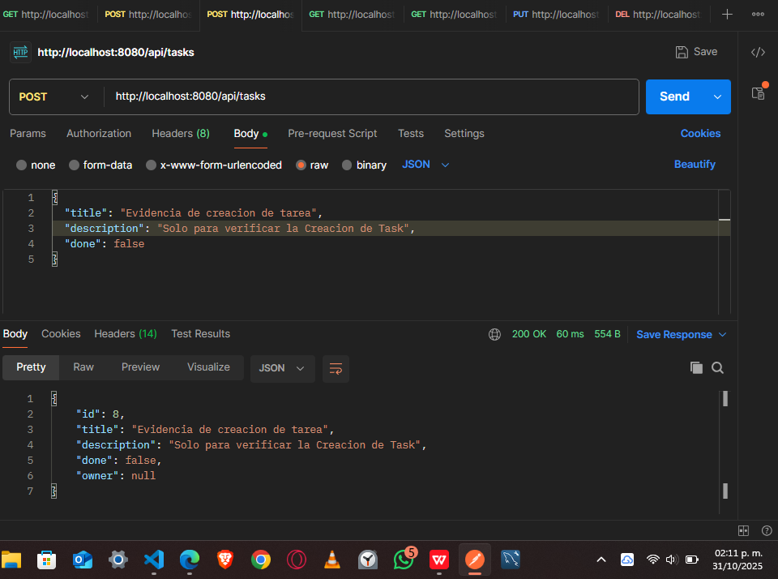
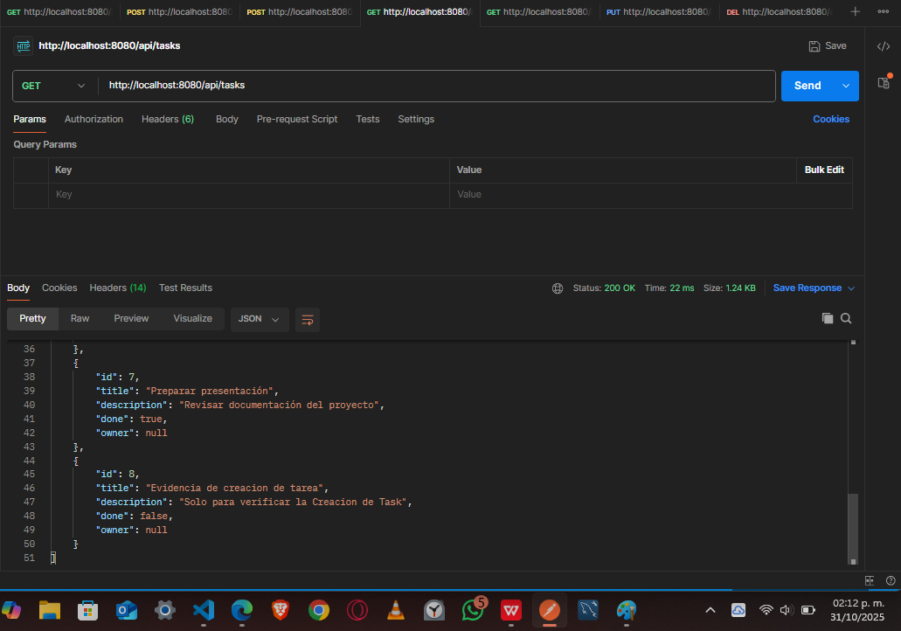
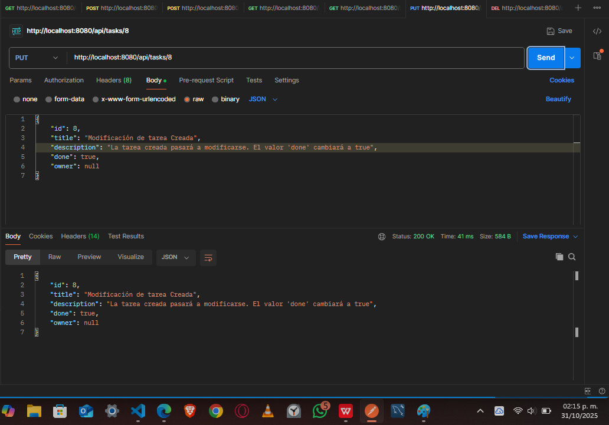
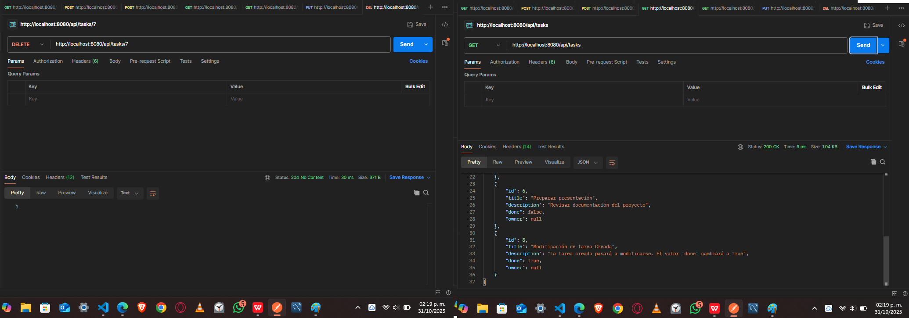
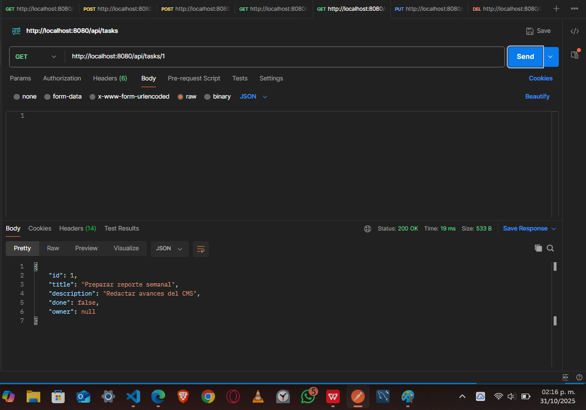
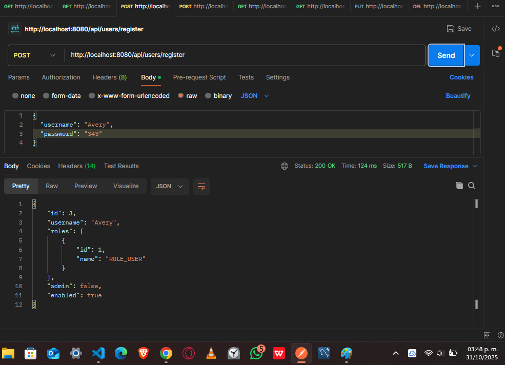
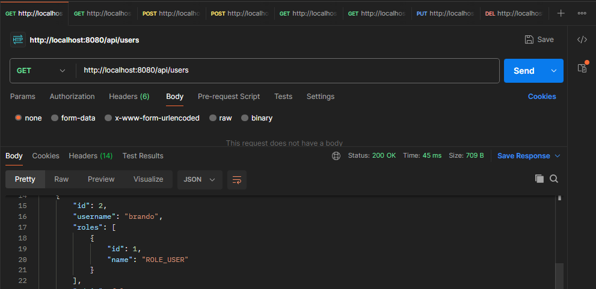
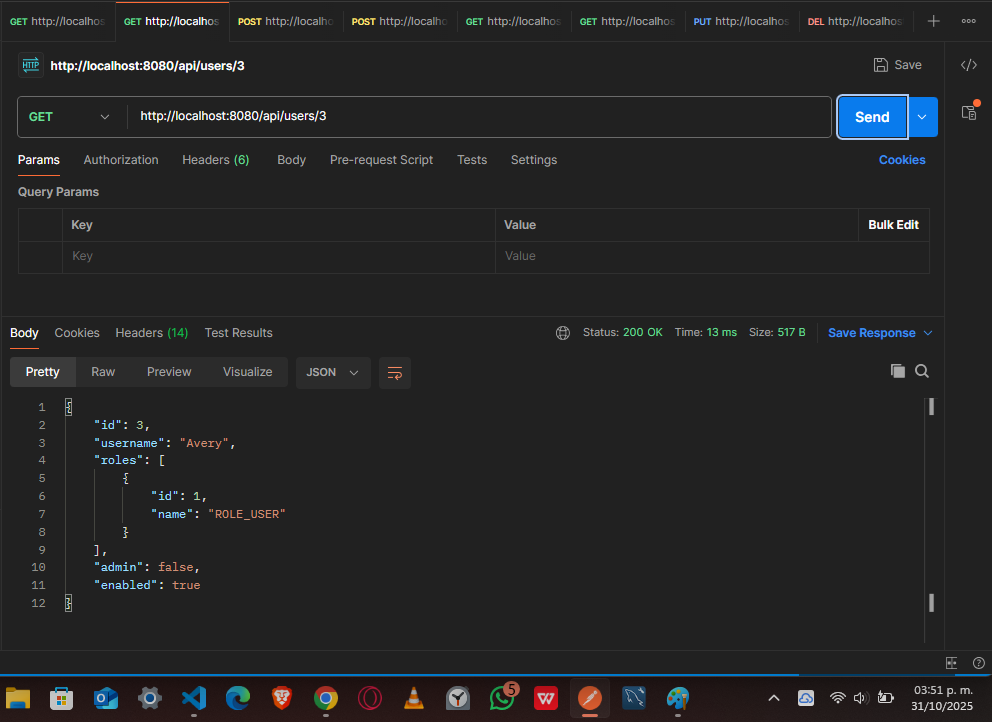

#  Gestor de Tareas - Task Manager

Aplicación CRUD para gestionar tareas usando Spring Boot.

##  Funcionalidades Implementadas

- [x] Crear tarea (`POST /tasks`)
- [x] Listar tareas (`GET /tasks`)
- [x] Actualizar tarea (`PUT /tasks/{id}`)
- [x] Eliminar tarea (`DELETE /tasks/{id}`)
- [x] Buscar tarea por Id(`GET /task/{id}`)

- [x] Crear usuario (`POST /users/register`)
- [x] Listar usuarios (`GET /users/`)
- [x] Buscar Usuario (`GET /users/{id}`)

- [x] Documentación con Swagger

##  Evidencias Task's

Las pruebas fueron realizadas con Postman. A continuación se muestran ejemplos de cada operación:

- **Crear tarea**: 
- **Listar tareas**: 
- **Actualizar tarea**: 
- **Eliminar tarea**: 
- **Buscar por id tarea**:

##  Evidencias User's
- **Crear usuario**: 
- **Listar usuarios**: 
- **Buscar usuario por Id**: 

##  Pendientes por implementar

- [ ] Seguridad con Spring Security y JWT
- [ ] Rol USER con permisos limitados
- [ ] Manejo de errores personalizado

